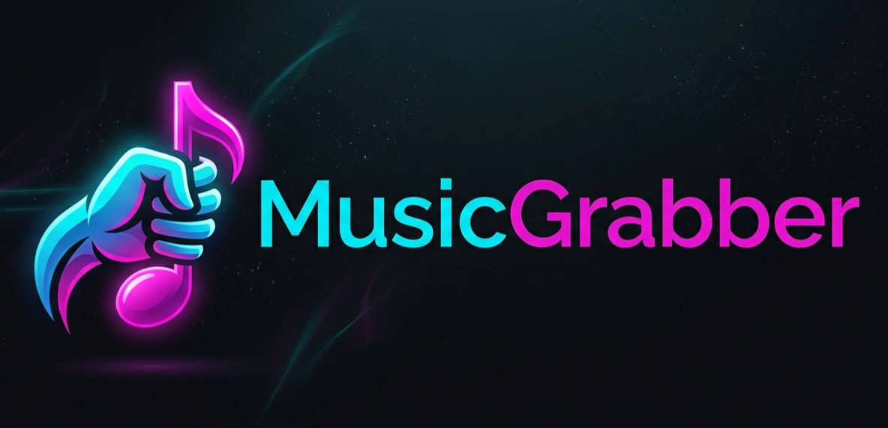

<p align="center">
  
</p>

# ◢◤ Music Grabber v1.1.1

**Music Grabber** es un orquestador de preservación digital diseñado para gestionar descargas de música con una arquitectura técnica resiliente y una interfaz TUI (Terminal User Interface) de estética cyberpunk.

Compatible con **Linux** (Fedora/Nobara, Ubuntu/Debian/Mint, Arch/Manjaro, openSUSE y derivadas) y **Windows 10/11**.

## ✨ Características

* **6 Modos de Orquestación:** Álbum, Recopilatorio, Playlist, Mix, Discografía y Huérfano. Cada modo genera una estructura de carpetas y nombres de archivo distinta.
* **Formatos de audio configurables:** MP3 (128 / 192 / 256 / 320 kbps), FLAC sin pérdida y OGG Vorbis. Cambiables desde F2 sin salir de la app.
* **Bootstrap Híbrido:** Detecta `yt-dlp` y `ffmpeg` del sistema; si no existen, los descarga y los mantiene actualizados automáticamente.
* **Arquitectura de Resiliencia:** Persistencia atómica de cola y protocolo de Rollback automático ante cierres inesperados.
* **Gestión Anti-Ban:** Tres perfiles de velocidad (Rápido / Seguro / Nocturno) para evitar bloqueos 403 de YouTube.
* **Historial integrado:** F4 muestra las últimas 200 descargas directamente en la TUI.
* **Detección de portapapeles:** Si copias una URL de YouTube con el campo vacío, se pega automáticamente.
* **Notificaciones de escritorio:** Avisa cuando un batch termina (Linux: `notify-send`; Windows: balloon tooltip).
* **Registro de fallos:** Las pistas que fallan se guardan en `Failures_Log.txt` con timestamp, URL e ID.
* **Estadísticas de sesión:** Contador acumulado de descargas, omisiones y fallos; timer de sesión y cola pendiente visibles en todo momento.

## 🚀 Instalación

### Linux (cualquier distribución con Python 3.9+)

```bash
git clone https://github.com/Team-Grab/MusicGrabber.git
cd MusicGrabber
bash install.sh
```

El script comprueba `python3` y `venv`, crea un entorno virtual aislado en `~/.local/share/MusicGrabber/venv`, instala las dependencias, deja el comando `musicgrabber` en `~/.local/bin/` y crea una entrada en el menú de aplicaciones.

Recomendado instalar `ffmpeg` y `yt-dlp` desde el gestor de paquetes:

| Distribución    | Comando                                    |
|-----------------|--------------------------------------------|
| Fedora / Nobara | `sudo dnf install ffmpeg yt-dlp`           |
| Debian / Ubuntu | `sudo apt install ffmpeg yt-dlp`           |
| Arch / Manjaro  | `sudo pacman -S ffmpeg yt-dlp`             |
| openSUSE        | `sudo zypper install ffmpeg yt-dlp`        |

Si no los instalas, Music Grabber los descarga al primer arranque en `~/.local/share/MusicGrabber/.bin/`.

Para desinstalar (conserva tu biblioteca y configuración):

```bash
bash install.sh --uninstall
```

### Windows 10 / 11

```powershell
irm https://raw.githubusercontent.com/Team-Grab/MusicGrabber/main/install.ps1 | iex
```

El script comprueba Python 3.9+ (lo instala con `winget` si falta), despliega la app en `%LOCALAPPDATA%\MusicGrabber\app`, crea venv, añade el comando `musicgrabber` al PATH del usuario y un acceso directo en el Menú Inicio.

Para desinstalar:

```powershell
& "$env:LOCALAPPDATA\MusicGrabber\app\install.ps1" -Uninstall
```

## 🎯 Uso

```bash
musicgrabber
```

Al primer arranque la app pide dónde guardar la biblioteca. Después: pega una URL de YouTube o YouTube Music, elige modo y velocidad, y arranca el protocolo. Para lotes, usa F3.

### Atajos

| Tecla   | Acción                                       |
|---------|----------------------------------------------|
| F1      | Manual e información                         |
| F2      | Configurar formato, calidad y biblioteca     |
| F3      | Carga masiva por lotes (batch)               |
| F4      | Historial de descargas (últimas 200)         |
| F5      | Reintentar pistas fallidas en Modo Nocturno  |
| F11     | Alternar cabecera/pie (más espacio vertical) |
| ESC     | Salir                                        |
| Ctrl+C  | Cancelar descarga activa / Salir si idle     |

## 📂 Estructura de archivos

```
MusicGrabber/
├── main.py                 # punto de entrada
├── core/
│   ├── state.py            # estado global + rutas cross-platform + configuración
│   ├── bootstrap.py        # detección/descarga de yt-dlp y ffmpeg
│   └── downloader.py       # motor de descargas, cola persistente y hooks
├── ui/
│   └── textual_app.py      # TUI completa (todas las pantallas)
├── assets/                 # logos e iconos
├── install.sh              # instalador Linux
├── install.ps1             # instalador Windows
└── requirements.txt        # dependencias pip
```

Datos de usuario:

* **Linux:** `~/.local/share/MusicGrabber/`
* **Windows:** `%LOCALAPPDATA%\MusicGrabber\`
* **macOS:** `~/Library/Application Support/MusicGrabber/` (experimental — `ffmpeg` requiere `brew install ffmpeg`)

Archivos generados en la biblioteca:

| Archivo                  | Contenido                                         |
|--------------------------|---------------------------------------------------|
| `Library_Ledger.log`     | Registro de cada descarga (ID, ruta)              |
| `.historial_descargas.txt` | IDs para detección de duplicados                |
| `Failures_Log.txt`       | Fallos con timestamp, URL e ID                    |
| `_Playlist/*.m3u8`       | Playlists generadas en modos 3 y 4               |

## 🛠️ Tecnologías

* **Lenguaje:** Python 3.9+
* **Interfaz:** Textual TUI
* **Motores:** yt-dlp + FFmpeg
* **Instaladores:** Bash (`install.sh`) y PowerShell (`install.ps1`)

## 📜 Créditos

* **Arquitectura y Lógica Core:** TeamGrab
* **Asistencia en Desarrollo y UI/UX:** IA
* **Librerías de Terceros:** yt-dlp, FFmpeg, Textual

---
*Este software ha sido creado con fines educativos y de preservación personal de archivos digitales.*
